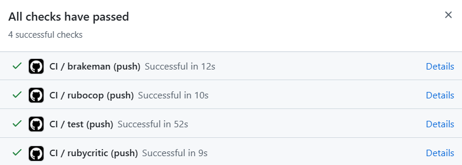
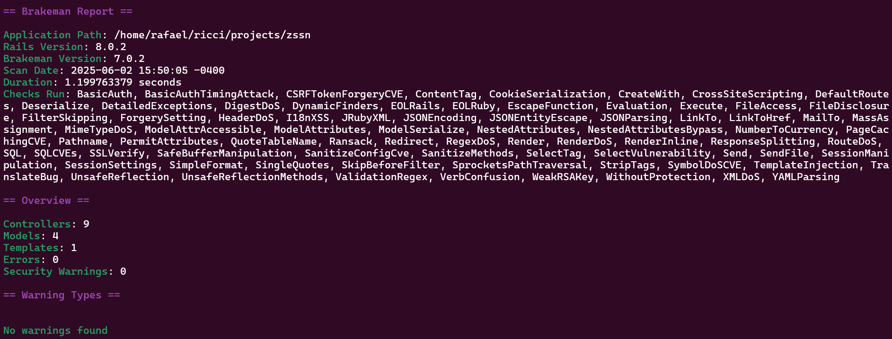
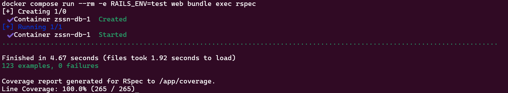
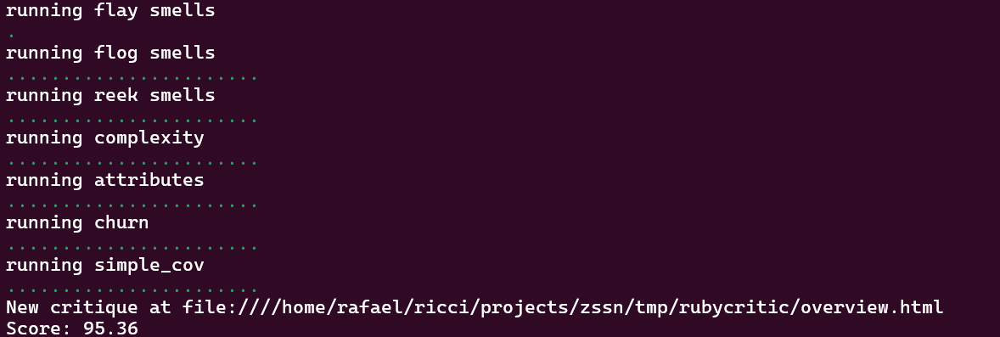

# 🧟 ZSSN – Zombie Survival Social Network

[Link do repositório](https://github.com/rafaelricci/zssn)

Sistema de gerenciamento de sobreviventes em um apocalipse zumbi, com controle de recursos, escambo e monitoramento de infecção.

---

## ✨ Tecnologias

- Ruby on Rails 8
- PostgreSQL
- JBuilder (JSON rendering)
- RSpec, FactoryBot, Faker (testes)
- SimpleCov, RubyCritic (cobertura e análise de qualidade)
- Dotenv (variáveis de ambiente)
- Docker + Docker Compose (opcional, Docker **v20.10.13+** com Compose **v2+** ativado)

## 🚀 Como rodar o projeto

### 👨‍💻 Modo 1 – Instalação local (sem Docker)

**Pré-requisitos**

- Ruby 3.4.4
- PostgreSQL
- Bundler (`gem install bundler`)

**Passos**

```
git clone https://github.com/rafaelricci/zssn.git
cd zssn
bundle install
cp .env.example .env
```
Edite o `.env`:
```
DB_USERNAME=postgres
DB_PASSWORD=postgres
DB_NAME_DEV=zssn_development
DB_NAME_TEST=zssn_test
DB_HOST=db
```
Configure o banco de dados:
```
rails db:create db:migrate
```
Inicie o servidor:
```
rails server
```
Execute os testes:
```
RAILS_ENV=test bundle exec rspec
```
### 🐳 Modo 2 – Ambiente com Docker
**Pré-requisitos**

-   Docker
-   Docker Compose
-   `make` instalado

**Passos**
```
cp .env.example .env
```
Edite o `.env`:
```
DB_USERNAME=postgres
DB_PASSWORD=postgres
DB_NAME_DEV=zssn_development
DB_NAME_TEST=zssn_test
DB_HOST=db
```

Utilize o make
```
make build      # constrói as imagens
make setup      # cria e migra o banco
make up         # inicia o app em http://localhost:3000
```
Rodar os testes:
```
make test
```
Outros comandos úteis:
| Comando |Ação  |
|--|--|
|`make down`| Para e remove os containers |
|`make db-reset`| Reseta o banco de dados |


## 📚 Endpoints da API

### Funcionalidades principais
-   `POST /api/v1/survivors` – Criar sobrevivente
-   `PUT /api/v1/survivors/:id` – Atualizar localização
-   `PUT /api/v1/survivors/:id/inventory` – Atualizar inventário
-   `POST /api/v1/infection_reports` – Reportar infecção
-   `POST /api/v1/trade` – Escambo

### Relatórios
-   `GET /api/v1/reports/infected_percentage`
-   `GET /api/v1/reports/non_infected_percentage`
-   `GET /api/v1/reports/average_items`
-   `GET /api/v1/reports/lost_points`

## 🔌 Exemplos com `curl`

### Criar sobrevivente
```
curl -X POST http://localhost:3000/api/v1/survivors \
  -H "Content-Type: application/json" \
  -d '{
    "survivor": {
      "name": "Alice",
      "age": 28,
      "gender": "female",
      "latitude": -12.345,
      "longitude": 45.678
    }
  }'
```
### Atualizar localização
```
curl -X PUT http://localhost:3000/api/v1/survivors/1 \
  -H "Content-Type: application/json" \
  -d '{
    "survivor": {
      "latitude": -10.000,
      "longitude": 50.000
    }
  }'
```
### Atualizar inventário
```
curl -X PUT http://localhost:3000/api/v1/survivors/1/inventory \
  -H "Content-Type: application/json" \
  -d '{
    "inventory": {
      "kind": "food",
      "operation": "add",
      "quantity": 3
    }
  }'

```
### Reportar infecção
```
curl -X POST http://localhost:3000/api/v1/infection_reports \
  -H "Content-Type: application/json" \
  -d '{
    "infection_report": {
      "reporter_id": 2,
      "reported_id": 1
    }
  }'
```
### Escambo entre sobreviventes
```
curl -X POST http://localhost:3000/api/v1/trade \
  -H "Content-Type: application/json" \
  -d '{
    "trade": {
      "offerer_id": 1,
      "receiver_id": 2,
      "offer_items": {
        "water": 1
      },
      "request_items": {
        "food": 1,
        "ammo": 1
      }
    }
  }'
```
### Relatórios
```
curl http://localhost:3000/api/v1/reports/infected_percentage
curl http://localhost:3000/api/v1/reports/non_infected_percentage
curl http://localhost:3000/api/v1/reports/average_items
curl http://localhost:3000/api/v1/reports/lost_points
```
## 📐 Arquitetura

-   Controllers enxutos com **Service Objects** (`callable`)    
-   Validações e regras de negócio encapsuladas nos models
-   Serialização JSON via JBuilder
-   Testes automatizados com RSpec e FactoryBot
-   Cobertura de testes com SimpleCov
-   Docker opcional para ambiente de desenvolvimento isolado

## 🧪 Testes
-   RSpec (`spec/`)
-   Cobertura: `coverage/` gerado pelo SimpleCov
-   Análise de qualidade: `rubycritic` (executar com `bundle exec rubycritic`)

## ✅ Status
- Completo (Atendendo a todos os requisitos do desafio)
- Pipeline 🟢 
	- 100% de aprovação Brakeman
	- 100% de cobertura de testes
	- 100% aprovação Rubocop
	- 95% de aprovação Rubycritic
- Docker-friendly (Setup Docker para desenvolvimento local)
- API RESTful  (Seguindo boas práticas de desenvolvimento de API RESTful)
- Sem autenticação (por proposta do desafio)

## Resultados em Anexo

GitHub Actions



Brakeman



Rspec + Simplecov



Rubycritic

